# 👩‍💻 Development & Contributing

Welcome to the development documentation for Kolosal AutoML! This section provides everything developers need to contribute to the project, set up development environments, and understand our development practices.

## 🚀 Quick Start for Developers

### Prerequisites
- Python 3.8+ (3.10+ recommended)
- Git
- Docker (optional, for containerized development)
- Visual Studio Code (recommended)

### Development Setup

```bash
# Clone the repository
git clone https://github.com/your-org/kolosal-automl.git
cd kolosal-automl

# Set up virtual environment
python -m venv venv
source venv/bin/activate  # On Windows: venv\Scripts\activate

# Install development dependencies
pip install -r requirements-dev.txt

# Install pre-commit hooks
pre-commit install

# Run tests to verify setup
pytest
```

## 📚 Development Documentation

### 🛠️ **Environment Setup**
- **[Development Setup](setup.md)** - Complete development environment configuration
- **[IDE Configuration](ide-setup.md)** - VS Code, PyCharm setup and extensions
- **[Docker Development](docker-dev.md)** - Containerized development workflow
- **[Database Setup](database-setup.md)** - Local database configuration

### 🏗️ **Architecture & Design**
- **[Project Structure](project-structure.md)** - Codebase organization and conventions
- **[Design Patterns](design-patterns.md)** - Architectural patterns used
- **[Code Standards](code-standards.md)** - Coding conventions and style guide
- **[API Design Guidelines](api-design.md)** - RESTful API design principles

### 🧪 **Testing**
- **[Testing Guide](testing.md)** - Comprehensive testing practices
- **[Test Strategy](test-strategy.md)** - Testing approach and methodology
- **[Performance Testing](performance-testing.md)** - Benchmarking and load testing
- **[Test Data Management](test-data.md)** - Managing test datasets

### 🤝 **Contributing**
- **[Contributing Guide](contributing.md)** - How to contribute to the project
- **[Pull Request Process](pull-requests.md)** - PR guidelines and review process
- **[Code Review Guidelines](code-review.md)** - Standards for code reviews
- **[Release Process](release-process.md)** - How we manage releases

### 📦 **Build & Deployment**
- **[Build System](build-system.md)** - Build tools and processes
- **[CI/CD Pipeline](ci-cd.md)** - Continuous integration and deployment
- **[Packaging](packaging.md)** - Creating distribution packages
- **[Deployment Automation](deployment-automation.md)** - Automated deployment processes

### 📊 **Monitoring & Debugging**
- **[Debugging Guide](debugging.md)** - Debugging techniques and tools
- **[Logging Standards](logging-standards.md)** - Logging best practices
- **[Performance Profiling](profiling.md)** - Performance analysis tools
- **[Error Handling](error-handling.md)** - Error handling patterns

## 🏗️ Project Structure

```
kolosal-automl/
├── 📁 modules/                 # Core business logic
│   ├── model_manager/          # Model lifecycle management
│   ├── training_engine/        # Training pipeline
│   ├── inference_engine/       # Prediction service
│   └── optimization/           # ASHT optimizer
├── 📁 api/                     # API layer
│   ├── routes/                 # API endpoints
│   ├── middleware/             # Request/response middleware
│   └── schemas/                # Request/response models
├── 📁 web/                     # Web interface
│   ├── components/             # React components
│   ├── pages/                  # Page components
│   └── utils/                  # Frontend utilities
├── 📁 tests/                   # Test suite
│   ├── unit/                   # Unit tests
│   ├── integration/            # Integration tests
│   └── e2e/                    # End-to-end tests
├── 📁 docs/                    # Documentation
├── 📁 scripts/                 # Utility scripts
├── 📁 configs/                 # Configuration files
└── 📁 monitoring/              # Monitoring and observability
```

## 🎯 Development Workflow

### Feature Development Process

```mermaid
graph LR
    A[🎯 Issue/Feature] --> B[🌿 Create Branch]
    B --> C[💻 Develop]
    C --> D[🧪 Test Locally]
    D --> E[📝 Commit Changes]
    E --> F[🔄 Push Branch]
    F --> G[📋 Create PR]
    G --> H[👀 Code Review]
    H --> I{✅ Approved?}
    I -->|No| J[🔧 Address Feedback]
    J --> C
    I -->|Yes| K[🚀 Merge to Main]
    K --> L[📦 Deploy to Staging]
    L --> M[✅ QA Testing]
    M --> N[🎉 Deploy to Production]
```



### Branch Strategy

- **`main`**: Production-ready code
- **`develop`**: Integration branch for features
- **`feature/feature-name`**: Individual feature development
- **`hotfix/fix-name`**: Critical production fixes
- **`release/version`**: Release preparation

### Commit Convention

We use [Conventional Commits](https://www.conventionalcommits.org/):

```
<type>[optional scope]: <description>

[optional body]

[optional footer(s)]
```

**Types:**
- `feat`: New features
- `fix`: Bug fixes
- `docs`: Documentation changes
- `style`: Code style changes
- `refactor`: Code refactoring
- `test`: Adding or updating tests
- `chore`: Build process or auxiliary tool changes

**Examples:**
```bash
feat(api): add batch prediction endpoint
fix(training): resolve memory leak in training loop
docs(readme): update installation instructions
test(inference): add performance regression tests
```

## 🧪 Testing Strategy

### Test Pyramid

```
    🔺
   /   \     Unit Tests (70%)
  /     \    - Fast execution
 /       \   - Isolated components
/__________\  - Mock dependencies

    🔻
   /   \     Integration Tests (20%)
  /     \    - API endpoints
 /       \   - Database interactions
/__________\  - Service integration

    🔺
   /   \     E2E Tests (10%)
  /     \    - User workflows
 /       \   - Browser automation
/__________\  - Production scenarios
```

### Testing Commands

```bash
# Run all tests
pytest

# Run with coverage
pytest --cov=modules --cov-report=html

# Run specific test categories
pytest tests/unit/          # Unit tests only
pytest tests/integration/   # Integration tests only
pytest tests/e2e/          # E2E tests only

# Run performance tests
pytest tests/performance/ --benchmark-only

# Run tests in parallel
pytest -n auto
```

### Quality Gates

Before code can be merged:
- ✅ All tests pass
- ✅ Code coverage ≥ 80%
- ✅ No critical security vulnerabilities
- ✅ Code style checks pass
- ✅ Documentation updated
- ✅ Performance benchmarks stable

## 🛠️ Development Tools

### Essential Tools

```bash
# Code quality
black          # Code formatting
isort          # Import sorting
flake8         # Linting
mypy           # Type checking
bandit         # Security scanning

# Testing
pytest         # Testing framework
pytest-cov    # Coverage reporting
pytest-mock   # Mocking utilities
factory-boy   # Test data generation

# Development utilities
pre-commit    # Git hooks
jupyter       # Interactive development
ipdb          # Debugging
watchdog      # File watching
```

### IDE Configuration

#### VS Code Extensions
```json
{
  "recommendations": [
    "ms-python.python",
    "ms-python.flake8",
    "ms-python.black-formatter",
    "ms-python.mypy-type-checker",
    "ms-vscode.test-adapter-converter",
    "ms-vscode.extension-test-runner"
  ]
}
```

#### Settings
```json
{
  "python.defaultInterpreterPath": "./venv/bin/python",
  "python.formatting.provider": "black",
  "python.linting.enabled": true,
  "python.linting.flake8Enabled": true,
  "python.testing.pytestEnabled": true
}
```

## 📈 Performance Considerations

### Performance Guidelines

1. **Algorithm Efficiency**: Choose appropriate algorithms for data size
2. **Memory Management**: Minimize memory footprint and leaks
3. **I/O Optimization**: Efficient file and network operations
4. **Caching Strategy**: Implement intelligent caching
5. **Parallel Processing**: Utilize multiprocessing where appropriate

### Profiling Tools

```bash
# Memory profiling
python -m memory_profiler script.py

# CPU profiling
python -m cProfile -o profile.stats script.py

# Line-by-line profiling
kernprof -l -v script.py

# Memory usage over time
mprof run script.py
mprof plot
```

## 🐛 Debugging Guide

### Debugging Tools

```python
# Built-in debugger
import pdb; pdb.set_trace()

# Enhanced debugger
import ipdb; ipdb.set_trace()

# VS Code debugging
# Set breakpoints in IDE

# Remote debugging
import debugpy
debugpy.listen(5678)
debugpy.wait_for_client()
```

### Common Issues

| Issue | Solution |
|-------|----------|
| Memory leaks | Use memory profiler, check for circular references |
| Slow performance | Profile code, optimize bottlenecks |
| Test failures | Check test isolation, mock external dependencies |
| Import errors | Verify PYTHONPATH, check virtual environment |

## 🔒 Security Considerations

### Security Practices

- **Input Validation**: Validate all user inputs
- **SQL Injection Prevention**: Use parameterized queries
- **Authentication**: Implement secure authentication
- **Authorization**: Enforce proper access controls
- **Data Encryption**: Encrypt sensitive data
- **Dependency Scanning**: Regular security updates

### Security Tools

```bash
# Security scanning
bandit -r modules/          # Code security analysis
safety check               # Dependency vulnerability check
semgrep --config=auto .     # Static analysis
```

## 📦 Build and Release

### Build Process

```bash
# Install build dependencies
pip install build twine

# Build packages
python -m build

# Check package
twine check dist/*

# Upload to PyPI (test)
twine upload --repository testpypi dist/*
```

### Release Checklist

- [ ] Version number updated
- [ ] Changelog updated
- [ ] All tests passing
- [ ] Documentation updated
- [ ] Security scan clean
- [ ] Performance benchmarks stable
- [ ] Migration scripts ready
- [ ] Deployment tested

## 🌍 Community

### Getting Help

- **Discord**: Join our development community
- **GitHub Issues**: Report bugs and request features
- **Stack Overflow**: Tag questions with `kolosal-automl`
- **Weekly Meetings**: Open development discussions

### Contributing Opportunities

- 🐛 **Bug Fixes**: Help fix reported issues
- ✨ **Features**: Implement new functionality
- 📚 **Documentation**: Improve guides and examples
- 🧪 **Testing**: Add test coverage
- 🎨 **UI/UX**: Enhance user interface
- 🔧 **DevOps**: Improve development processes

---

## 🎯 Next Steps

1. **Set up your development environment** using our [setup guide](setup.md)
2. **Pick a good first issue** labeled with `good-first-issue`
3. **Join our community** channels for support and discussions
4. **Read our contributing guide** for detailed contribution instructions

Welcome to the team! We're excited to see what you'll build. 🚀
