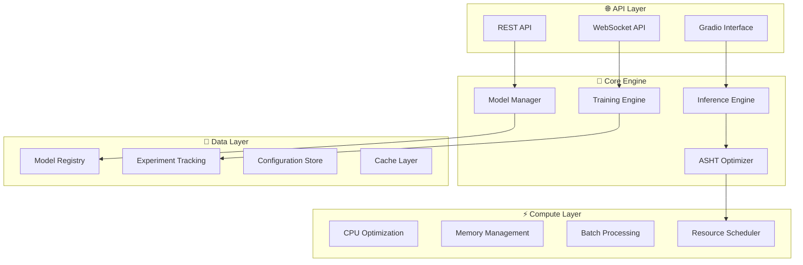

# 🛠️ Technical Documentation

Welcome to the technical documentation for Kolosal AutoML. This section provides deep technical insights into the platform's architecture, algorithms, and advanced features for developers, ML engineers, and system administrators.

## 🏗️ Architecture Overview



## 📚 Documentation Sections

### 🏗️ **System Architecture**
- **[Architecture Overview](architecture.md)** - High-level system design and components
- **[API Architecture](api-architecture.md)** - RESTful API design patterns and structure
- **[Data Flow](data-flow.md)** - How data moves through the system
- **[Security Architecture](security-architecture.md)** - Security layers and protocols

### ⚡ **Performance & Optimization**
- **[Performance Optimization](performance.md)** - System-wide performance tuning
- **[Memory Management](memory-management.md)** - Efficient memory usage strategies
- **[CPU Optimization](cpu-optimization.md)** - Multi-core and vectorization optimizations
- **[Caching Strategies](caching.md)** - Intelligent caching for improved performance

### 🧩 **Core Modules**
- **[Model Manager](modules/model-manager.md)** - Model lifecycle management
- **[Training Engine](modules/training-engine.md)** - Automated training pipeline
- **[Inference Engine](modules/inference-engine.md)** - High-performance prediction service
- **[ASHT Optimizer](modules/asht-optimizer.md)** - Adaptive hyperparameter tuning system

### 🔧 **Advanced Features**
- **[Advanced Features Guide](advanced-features.md)** - Power-user capabilities
- **[Custom Algorithms](custom-algorithms.md)** - Integrating custom ML algorithms
- **[Plugin System](plugin-system.md)** - Extending platform functionality
- **[Batch Processing Engine](batch-processing.md)** - High-throughput processing system

### 🔒 **Security & Compliance**
- **[Security Implementation](security.md)** - Detailed security mechanisms
- **[Authentication System](authentication.md)** - User authentication and authorization
- **[Data Privacy](data-privacy.md)** - Data protection and privacy controls
- **[Audit System](audit-system.md)** - Activity logging and compliance

### 📊 **Monitoring & Observability**
- **[Monitoring System](monitoring.md)** - Comprehensive system monitoring
- **[Metrics Collection](metrics.md)** - Performance and business metrics
- **[Logging Framework](logging.md)** - Structured logging and analysis
- **[Alerting System](alerting.md)** - Automated issue detection and notification

### 🛠️ **Configuration & Deployment**
- **[Configuration Management](configuration.md)** - System configuration options
- **[Environment Setup](environment-setup.md)** - Development and production environments
- **[Scaling Strategies](scaling.md)** - Horizontal and vertical scaling approaches
- **[DevOps Integration](devops-integration.md)** - CI/CD and automation

## 🎯 Technical Deep Dives

### 🧠 Machine Learning Components

#### ASHT (Adaptive Stochastic Hyperparameter Tuning)
Our proprietary optimization algorithm that adapts hyperparameter search based on:
- Historical performance patterns
- Resource constraints
- Convergence predictions
- Multi-objective optimization

```python
# ASHT optimization process
class ASHTOptimizer:
    def optimize(self, space, objective, trials=100):
        # Adaptive search with learning rate adjustment
        # Multi-armed bandit for algorithm selection
        # Bayesian optimization with GP surrogate
        # Early stopping with convergence detection
```

#### Intelligent Model Selection
- **Algorithm Ensemble**: Combines multiple algorithms intelligently
- **Meta-learning**: Learns from previous training experiences
- **Transfer Learning**: Leverages pre-trained components
- **Dynamic Architecture**: Adapts model complexity to data

### ⚡ Performance Engineering

#### JIT Compilation Integration
- **Numba Integration**: Accelerated numerical computations
- **PyTorch JIT**: Optimized deep learning operations
- **Custom Kernels**: Hardware-optimized compute kernels

#### Memory Optimization
- **Lazy Loading**: Load data only when needed
- **Memory Mapping**: Efficient large dataset handling
- **Garbage Collection**: Optimized memory cleanup
- **Buffer Pools**: Reusable memory allocations

#### Parallel Processing
- **Multi-threading**: CPU-bound operation parallelization
- **Async Processing**: I/O-bound operation optimization
- **Distributed Computing**: Multi-node processing support
- **GPU Acceleration**: CUDA/OpenCL integration

### 🔧 System Integration

#### Database Optimization
- **Connection Pooling**: Efficient database connections
- **Query Optimization**: Optimized SQL generation
- **Indexing Strategies**: Performance-oriented database design
- **Caching Layers**: Multi-level caching implementation

#### API Performance
- **Request Batching**: Efficient bulk operations
- **Response Compression**: Reduced bandwidth usage
- **Connection Keep-alive**: Persistent connections
- **Rate Limiting**: Fair resource usage

## 🔍 Algorithm Details

### Supported Algorithms

| Category | Algorithms | Optimization Level |
|----------|------------|-------------------|
| **Tree-based** | XGBoost, LightGBM, CatBoost | ⭐⭐⭐⭐⭐ |
| **Linear** | Logistic, Ridge, Lasso, ElasticNet | ⭐⭐⭐⭐ |
| **Neural Networks** | MLP, CNN, LSTM, Transformer | ⭐⭐⭐⭐⭐ |
| **Ensemble** | Random Forest, Extra Trees | ⭐⭐⭐⭐ |
| **Bayesian** | Naive Bayes, Gaussian Process | ⭐⭐⭐ |
| **SVM** | Linear SVM, RBF SVM | ⭐⭐⭐ |
| **Clustering** | K-Means, DBSCAN, Hierarchical | ⭐⭐⭐ |

### Algorithm Selection Logic

```python
def select_algorithm(data_characteristics):
    """
    Intelligent algorithm selection based on:
    - Dataset size and dimensionality
    - Problem type (classification/regression)
    - Computational constraints
    - Accuracy requirements
    - Interpretability needs
    """
    if data_characteristics.size > 1_000_000:
        return ["LightGBM", "XGBoost"]  # Scalable options
    elif data_characteristics.interpretability_required:
        return ["LinearModels", "TreeBased"]  # Interpretable models
    else:
        return get_ensemble_candidates()  # Best performance
```

## 📈 Performance Benchmarks

### Training Performance
- **Small datasets** (<10K samples): 2-5 seconds
- **Medium datasets** (10K-100K samples): 30 seconds - 2 minutes  
- **Large datasets** (100K-1M samples): 2-15 minutes
- **XL datasets** (1M+ samples): 15 minutes - 2 hours

### Inference Performance
- **Single prediction**: <10ms average
- **Batch prediction** (1K samples): 100-500ms
- **Streaming prediction**: 1000+ predictions/second
- **Memory usage**: 100-500MB per model

### Scalability Metrics
- **Concurrent users**: 100+ simultaneous users
- **Model serving**: 50+ models simultaneously  
- **Throughput**: 10,000+ predictions/minute
- **Uptime**: 99.9% availability target

## 🧪 Testing & Quality Assurance

### Test Coverage
- **Unit Tests**: 90%+ code coverage
- **Integration Tests**: API and component testing
- **Performance Tests**: Benchmark validation
- **Security Tests**: Vulnerability scanning

### Quality Metrics
- **Code Quality**: SonarQube analysis
- **Performance Monitoring**: Continuous benchmarking
- **Error Tracking**: Comprehensive error monitoring
- **User Experience**: Interface usability testing

## 📝 Development Standards

### Code Standards
- **Style Guide**: PEP 8 compliance
- **Documentation**: Comprehensive docstrings
- **Type Hints**: Full type annotation
- **Testing**: Test-driven development

### Architecture Principles
- **Modularity**: Loosely coupled components
- **Scalability**: Horizontal scaling design
- **Maintainability**: Clean, readable code
- **Performance**: Optimization at every layer

---

## 🔗 Related Resources

- **[Development Setup](../development/setup.md)** - Setting up development environment
- **[API Reference](../api-reference/)** - Complete API documentation
- **[Deployment Guide](../deployment/)** - Production deployment
- **[User Guides](../user-guides/)** - End-user documentation

## 🤝 Contributing

Help improve our technical documentation:

1. **Technical Reviews**: Review architecture decisions
2. **Code Examples**: Add technical examples and snippets
3. **Performance Analysis**: Contribute benchmark results
4. **Best Practices**: Share optimization techniques

See our [Contributing Guide](../development/contributing.md) for details.
