# 🎓 Kolosal AutoML User Guides

Welcome to the comprehensive user guides for Kolosal AutoML! These guides are designed to help you get the most out of our automated machine learning platform, whether you're a data scientist, ML engineer, or business analyst.

## 📖 Guide Categories

### 🌐 Web Interface
- **[Web Interface Guide](web-interface.md)** - Complete guide to using the Gradio web interface
- **[Dashboard Overview](dashboard.md)** - Understanding the main dashboard and navigation
- **[File Upload & Data Management](data-management.md)** - Working with datasets and files

### 🚂 Model Training & Development
- **[Training Models](training-models.md)** - Step-by-step model training guide
- **[Advanced Training Options](advanced-training.md)** - Custom configurations and parameters
- **[Hyperparameter Tuning](hyperparameter-tuning.md)** - Optimizing model performance
- **[Model Evaluation](model-evaluation.md)** - Understanding metrics and validation

### ⚡ Inference & Predictions
- **[Making Predictions](inference.md)** - Single and batch predictions guide
- **[Real-time Inference](realtime-inference.md)** - Live prediction workflows
- **[Model Deployment](model-deployment.md)** - Deploying trained models

### 📦 Batch Processing
- **[Batch Processing Guide](batch-processing.md)** - High-throughput data processing
- **[Queue Management](queue-management.md)** - Managing processing queues
- **[Scheduling & Automation](scheduling.md)** - Automated workflows

### 📊 Data Management
- **[Data Preparation](data-preparation.md)** - Preparing datasets for training
- **[Feature Engineering](feature-engineering.md)** - Creating and selecting features
- **[Data Quality Checks](data-quality.md)** - Ensuring data integrity

### 🛠️ Configuration & Settings
- **[System Configuration](system-configuration.md)** - Basic system settings
- **[Performance Tuning](performance-tuning.md)** - Optimizing system performance
- **[Resource Management](resource-management.md)** - Managing compute resources

## 🚀 Quick Start Path

If you're new to Kolosal AutoML, follow this recommended learning path:

```mermaid
graph TD
    A[📖 Getting Started] --> B[🌐 Web Interface Guide]
    B --> C[📊 Data Preparation]
    C --> D[🚂 Training Models]
    D --> E[📈 Model Evaluation]
    E --> F[⚡ Making Predictions]
    F --> G[📦 Batch Processing]
    G --> H[🛠️ Advanced Features]
```

## 🎯 User Journey by Role

### 👨‍🔬 **Data Scientists**
1. Start with [Data Preparation](data-preparation.md)
2. Learn [Advanced Training Options](advanced-training.md)
3. Master [Hyperparameter Tuning](hyperparameter-tuning.md)
4. Explore [Model Evaluation](model-evaluation.md)

### 👩‍💼 **Business Analysts**  
1. Begin with [Web Interface Guide](web-interface.md)
2. Learn [Training Models](training-models.md)
3. Understand [Making Predictions](inference.md)
4. Use [Dashboard Overview](dashboard.md)

### 🛠️ **ML Engineers**
1. Review [System Configuration](system-configuration.md)
2. Master [Batch Processing](batch-processing.md)
3. Learn [Performance Tuning](performance-tuning.md)
4. Implement [Real-time Inference](realtime-inference.md)

## 📚 Additional Resources

- **[API Reference](../api-reference/)** - Complete API documentation
- **[Technical Documentation](../technical/)** - System architecture and internals
- **[Deployment Guides](../deployment/)** - Production deployment options
- **[Development Resources](../development/)** - Contributing and development setup

## 🆘 Getting Help

- **[Troubleshooting Guide](troubleshooting.md)** - Common issues and solutions
- **[FAQ](faq.md)** - Frequently asked questions
- **[Community Support](community.md)** - Getting help from the community

---

## 📝 Contributing to User Guides

Help us improve these guides! If you find errors or have suggestions:

1. Check our [Contributing Guide](../development/contributing.md)
2. Submit issues or pull requests
3. Share your use cases and examples

These guides are living documents that evolve with the platform and community feedback.
