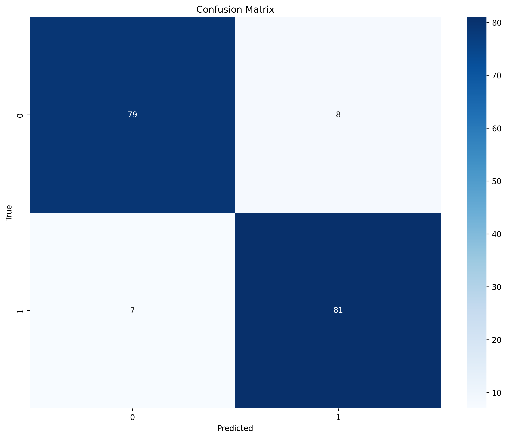

# Experiment Report: experiment_1754484233

**Experiment ID:** 1754484233  
**Date:** 2025-08-06 19:43:54  
**Duration:** 40.22 seconds  

## Configuration

| Parameter | Value |
| --- | --- |
| task_type | classification |
| random_state | 42 |
| n_jobs | -1 |
| verbose | 1 |
| cv_folds | 3 |
| test_size | 0.3 |
| stratify | True |
| optimization_strategy | hyper_optimization_x |
| optimization_iterations | 50 |
| optimization_timeout | None |
| early_stopping | True |
| early_stopping_rounds | 10 |
| early_stopping_metric | None |
| feature_selection | True |
| feature_selection_method | mutual_info |
| feature_selection_k | None |
| feature_importance_threshold | 0.01 |
| model_path | ./test_models |
| model_registry_url | None |
| auto_version_models | True |
| experiment_tracking | True |
| experiment_tracking_platform | mlflow |
| use_intel_optimization | True |
| use_gpu | True |
| gpu_memory_fraction | 0.8 |
| memory_optimization | True |
| enable_distributed | False |
| distributed_strategy | mirrored |
| checkpointing | True |
| checkpoint_interval | 10 |
| checkpoint_path | ./test_models\checkpoints |
| enable_pruning | False |
| auto_ml | disabled |
| auto_ml_time_budget | None |
| ensemble_models | False |
| ensemble_method | stacking |
| ensemble_size | 3 |
| hyperparameter_tuning_cv | True |
| model_selection_criteria | accuracy |
| auto_save | True |
| auto_save_on_shutdown | True |
| save_state_on_shutdown | False |
| load_best_model_after_train | True |
| enable_quantization | False |
| enable_model_compression | False |
| compression_method | pruning |
| compute_permutation_importance | True |
| generate_feature_importance_report | True |
| generate_model_summary | True |
| generate_prediction_explanations | False |
| enable_model_export | True |
| auto_deploy | False |
| deployment_platform | None |
| log_level | INFO |
| debug_mode | False |
| enable_telemetry | False |
| backend | sklearn |
| enable_data_validation | True |
| enable_security | False |
| optimization_metric | None |

## Model Information

| Parameter | Value |
| --- | --- |
| model_type | random_forest |
| model_class | sklearn.ensemble._forest.RandomForestClassifier |
| task_type | classification |

## Performance Metrics

No overall metrics recorded.

## Step Metrics

### Step: feature_selection

| Metric | Value |
| --- | --- |
| selected_feature_count | 20.0000 |
| total_feature_count | 20.0000 |

### Step: optimization_setup

| Metric | Value |
| --- | --- |
| param_combinations | grid |
| cv_folds | 3.0000 |
| scoring | f1_weighted |

### Step: validation

| Metric | Value |
| --- | --- |
| accuracy | 0.9143 |
| f1 | 0.9143 |
| precision | 0.9143 |
| recall | 0.9143 |
| roc_auc | 0.9862 |

## Feature Importance

| Feature | Importance |
| --- | --- |
| feature_14 | 0.1232 |
| feature_11 | 0.1072 |
| feature_17 | 0.0955 |
| feature_15 | 0.0803 |
| feature_7 | 0.0564 |
| feature_2 | 0.0556 |
| feature_16 | 0.0543 |
| feature_9 | 0.0525 |
| feature_1 | 0.0501 |
| feature_18 | 0.0480 |
| feature_3 | 0.0428 |
| feature_8 | 0.0375 |
| feature_4 | 0.0347 |
| feature_12 | 0.0338 |
| feature_0 | 0.0332 |
| feature_5 | 0.0232 |
| feature_10 | 0.0208 |
| feature_6 | 0.0180 |
| feature_19 | 0.0175 |
| feature_13 | 0.0154 |

## Confusion Matrix

## Artifacts

* [confusion_matrix](confusion_matrix_1754484233.png)
